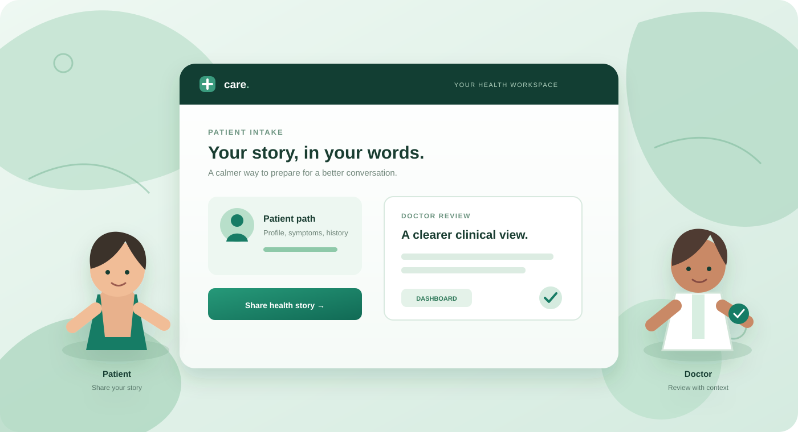
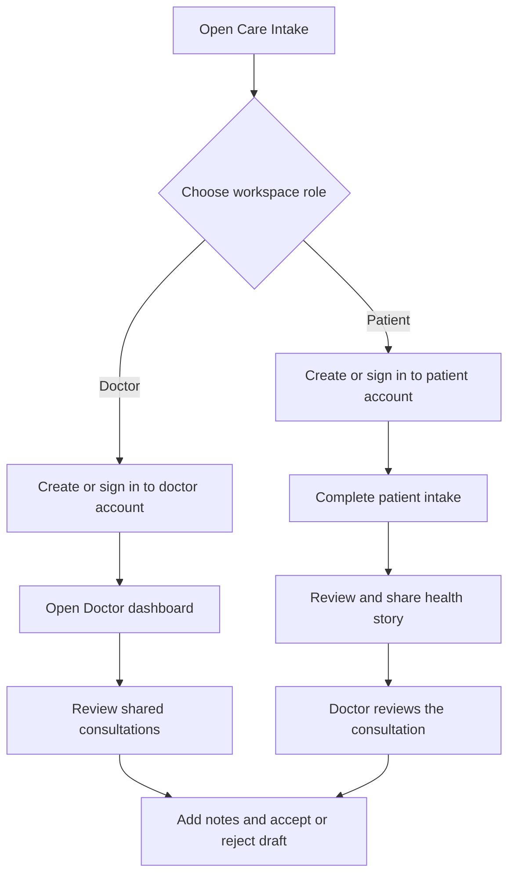

# Care Intake — frontend + FastAPI backend

Complete editable source for the existing Care Intake UI, connected to patient records, Sarvam voice transcription, Gemini clinical assistance, document extraction, doctor review, and downloadable draft PDFs.

The original layout, CSS, colors, interview screens, and navigation are retained. API loading/error states, saved history, language options, and PDF download actions have been connected. All generated PDFs remain **AI-assisted drafts requiring physician approval**.

## Start here on your Mac

1. Extract the ZIP completely. Open **Care-Intake-Full-Project** in VS Code.
2. Open a terminal **inside this folder**. You should see `frontend`, `backend`, and `scripts` when you run `ls`. If you are already inside it, do not run `cd Care-Intake-Full-Project` again.
3. Check Python: `python3 --version`. Python **3.12** is the tested version; 3.11+ is required.

For the easiest first local run, use SQLite. This is an explicit development option; PostgreSQL/Supabase instructions are below.

```bash
python3 scripts/setup.py --sqlite
open -a TextEdit backend/.env
```

Setup installs dependencies into a private `.venv` and **creates the missing `.env` for you**. In TextEdit, fill these lines with your own keys and save as plain text:

```dotenv
SARVAM_API_KEY=your_sarvam_key
GEMINI_API_KEY=your_gemini_key
OCR_API_KEY=your_ocr_space_key
```

Do not replace `FIELD_ENCRYPTION_KEY` or `DEV_AUTH_TOKEN`; setup already generated them. If you only have Sarvam, voice transcription works once its key is configured. **Clinical analysis and the resulting AI PDF also need Gemini.** OCR is optional for typed input and PDFs with an embedded text layer; scanned PDFs and images require the OCR key.

Then run:

```bash
python3 scripts/run.py
```

Open [Care Intake](http://127.0.0.1:5173/). Keep the terminal open. Use the complete URL with port `5173`; do not open bare `localhost` or port `80`, because that is not the Care proxy. Ctrl+C stops both servers. Next time, only `python3 scripts/run.py` is needed. After setup, `START-MAC.command` is also available; if macOS does not allow double-clicking it, use the terminal command above.

### Workspace login and roles

On the first visit, choose **Patient** or **Doctor**, then create a workspace account with your name, email, and a password of 12–128 characters. The selected role is stored with the account. On later visits, choose the same role and sign in with that account's exact email and password. A patient account cannot be converted into a doctor session by selecting **Doctor** at login; the stored account role is always authoritative.

Patient accounts open the patient intake, records, and visit-history experience. Doctor accounts open the Doctor dashboard and physician console. Patient accounts do not receive doctor navigation, and doctor dashboard API requests from a patient session are rejected by the backend.

The local account is saved in the database's `workspace_accounts` table using a salted password hash; the plain password is never stored. The local prototype supports one patient account and one doctor account per workspace. Existing `backend/.local-auth.json` accounts are imported into the database on the next startup. Sessions last up to eight hours and are held in memory, so restarting the local server signs everyone out.

Patient details, consultation snapshots, generated PDF bytes, and PDF metadata are encrypted and saved in the database. This is a local prototype: email password recovery, invitations, and multi-user organization management require production identity integration.

If the app was already running when authentication or role changes were added, stop it with Ctrl+C and run `python3 scripts/run.py` again to load the updated routes.

#### Choose the right path

<p align="center">
	
</p>

The prototype has two clear experiences: patients share the information they want reviewed, while doctors use a protected workspace to review shared consultations. The account role selected during setup controls which experience opens.



<details>
<summary><strong>Patient quick guide</strong></summary>

Choose **Patient**, create or sign in to your patient account, complete the guided questions, add optional documents, and share the draft with the doctor. Patient accounts cannot open the Doctor dashboard.

</details>

<details>
<summary><strong>Doctor quick guide</strong></summary>

Choose **Doctor**, create or sign in to the doctor account, open the Doctor dashboard, select a consultation, review the patient-reported information and AI-assisted draft, then record the clinical decision.

</details>

### Doctor dashboard

Doctor accounts open on **Doctor dashboard** after signing in. The sidebar also provides access at any time. The dashboard shows consultation totals, drafts awaiting review, completed reviews, and intakes still in progress. Select a status to filter the queue, use **Next**/**Previous** to browse visits, or **Refresh** to fetch recent changes. Patient accounts do not see this dashboard.

Select **Review** to open a prepared consultation in the physician console. You can amend its summary, enter doctor notes, accept or reject the draft, and download its PDF. Notes are saved when you record the review. **View intake** opens a read-only overview when analysis is not ready. The dashboard includes only consultations you own or that are shared with your doctor account.

After installing the dashboard changes, restart `python3 scripts/run.py` and reload the browser. The dashboard uses existing consultation records and requires no additional database migration.

**Do not open `frontend/index.html` by double-clicking.** Use [http://127.0.0.1:5173/](http://127.0.0.1:5173/) while the launcher is running so the API connections work. There is no required npm install or frontend build step; this UI is plain HTML, CSS, and JavaScript. After Python setup, `npm run dev` is an optional equivalent launcher. The original stylesheet optionally loads Google Fonts and uses system fallbacks offline.

## PostgreSQL / Supabase

For PostgreSQL from the beginning, omit `--sqlite`:

```bash
python3 scripts/setup.py
docker compose up -d db
```

The default `DATABASE_URL` matches the local PostgreSQL service in `compose.yaml`. Set your provider keys in `backend/.env`, then run `python3 scripts/run.py`. Migrations run before the API starts. Docker is only needed for this local PostgreSQL option, not for the SQLite trial.

To use Supabase, set `DATABASE_URL` to your project's **PostgreSQL connection string**, for example:

```dotenv
DATABASE_URL=postgresql+psycopg://DB_USER:URL_ENCODED_PASSWORD@DB_HOST:5432/postgres?sslmode=require
```

Use your actual host, port, and user from Supabase Connect. Prefer the direct connection or session pooler for SQLAlchemy and migrations. A Supabase anon key is not a database URL. The migration/database role must own the clinical tables; browser clients must never receive database credentials. PostgreSQL RLS and revoked browser-role grants block direct Supabase Data API access; the authenticated FastAPI routes enforce ownership and doctor sharing.

Setup preserves an existing `.env`. Running setup again with `--sqlite` does not switch an existing PostgreSQL configuration. Edit `DATABASE_URL` intentionally. Switching databases does not migrate existing patient data.

## Windows

Open PowerShell in the extracted project folder:

```powershell
py scripts/setup.py --sqlite
notepad backend/.env
py scripts/run.py
```

After entering the keys, open http://localhost:5173. `START-WINDOWS.bat` is a convenience launcher after setup. Windows and macOS were not available for runtime testing; the setup/launcher scripts use platform-aware Python paths.

## Try the connected workflow

1. Enter a fictional patient's profile, select consent, and start the interview. The initial screen contains no real patient or preselected consent.
2. Answer the existing five questions. You can type, choose an answer, or record up to 25 seconds with the mic. Allow microphone access on localhost. Review each transcript before continuing.
3. Upload an optional PDF, PNG, or JPEG. Documents are extracted and stored; uploads have a 10 MiB limit and PDFs have a 20-page limit. Your provider plan can impose stricter limits.
4. Review the Gemini assistance draft and its missing-information/follow-up fields. Edit the existing summary fields as needed. Select **Download draft PDF** to save the summary and your amendments as a PDF. Select sharing, then continue when ready for doctor review.
5. Open the physician console to record an authenticated review and download the draft PDF. Review does not make it a signed prescription.
6. Open Visit history to reload a consultation. New intake asks whether this is another visit for the same patient; choosing another patient creates a separate record.

The local development launcher protects a workspace with role-aware patient and doctor logins. Real multi-user patient and doctor accounts, password recovery, invitations, and organization membership require your Supabase authentication host and the production configuration described in `docs/DEPLOYMENT.md`.

## What's included

| Path | Purpose |
| --- | --- |
| `frontend/index.html` | Existing UI entry point |
| `frontend/src/css/styles.css` | Original stylesheet |
| `frontend/src/js/views.js` | Original screen components |
| `frontend/src/js/api.js` | API transport and authenticated downloads |
| `frontend/src/js/dashboard.js` / `frontend/src/css/dashboard.css` | Doctor overview, status filters, and consultation queue |
| `frontend/src/js/auth.js` / `frontend/src/css/auth.css` | Workspace setup, sign-in, and session handling |
| `scripts/local_auth.py` | Local password verification and cookie sessions |
| `frontend/src/js/integration.js` | Intake, audio, documents, history, review, PDF bindings |
| `backend/app/main.py` | FastAPI application and scoped routes |
| `backend/app/models.py` | SQLAlchemy patient, consultation, analysis, document, prescription, audit models |
| `backend/app/services/` | Sarvam, Gemini, OCR, upload validation, PDF services |
| `backend/migrations/` | Versioned database schema |
| `backend/tests/` | API, provider contract, access-control, and PDF tests |
| `backend/.env.example` | Complete configuration template |
| `scripts/` | Cross-platform setup and local launchers |
| `docs/API.md` | Request examples and route documentation |
| `docs/DEPLOYMENT.md` | Production authentication and deployment foundation |
| `docs/STATUS.md` | What is implemented, verified, and still deployment-specific |

Swagger is at [127.0.0.1:5173/docs](http://127.0.0.1:5173/docs) through the local authenticated proxy. Direct API documentation is at [127.0.0.1:8000/docs](http://127.0.0.1:8000/docs); use its Authorize button with the generated `DEV_AUTH_TOKEN` if calling it directly.

## Tests

```bash
python3 scripts/setup.py --dev
.venv/bin/python -m pytest -q
```

On Windows the test command is `.venv\Scripts\python.exe -m pytest -q`. Tests use temporary SQLite records and mocked provider HTTP responses; they do not spend API credits. Real provider access, clinical quality, and deployed Supabase authorization must also be validated in your configured environment.

## Troubleshooting

| Problem | Action |
| --- | --- |
| `.env` missing | Run setup from the project root. It creates `backend/.env`. Finder hides files beginning with a dot; use Cmd+Shift+. or `open -a TextEdit backend/.env`. |
| `cd: no such file or directory` | Run `pwd` and `ls`. Open the extracted folder containing `backend`, `frontend`, and `scripts`. Do not enter the same folder twice. |
| `uvicorn: command not found` | Run `python3 scripts/run.py`. It uses the installed virtual environment automatically. |
| White screen / API unavailable | Use http://localhost:5173 with the launcher running. Hard refresh with Cmd+Shift+R. All JS/CSS files are included locally. |
| Port 5173 or 8000 already in use | Stop the older development server with Ctrl+C before launching this folder. |
| Gemini key/model/403/429 error | Confirm `GEMINI_API_KEY`, account permissions, enabled model, quota, and billing in your provider account. Sarvam's key cannot authenticate Gemini. No fabricated report is substituted. |
| Gemini HTTP 404 / model unavailable | Set `GEMINI_MODEL=gemini-3.5-flash` in `backend/.env` (or another model accessible to your key), then restart the launcher. Gemini 2.5 access can be restricted even when the model appears in the model list. Retry **Review summary**, then select **Download draft PDF**. |
| OCR fails on an image | Set an OCR.space key, select an OCR language your account supports, and check scan quality/plan limits. Radiology image interpretation is not implemented. |
| 409 record changed | Reload the consultation from Visit history and retry. This prevents a stale draft overwriting newer information. |
| Microphone blocked | Allow microphone permission for localhost, or type your answer. The browser must support MediaRecorder. |
| PDF unsupported character | Bundled fonts cover English and major Indian scripts. Unsupported characters produce a clear error; use a supported spelling or install the required font. The original record remains saved. |
| Changed encryption key | Restore the original key from your backup. A new key cannot decrypt existing records. |

Live use requires clinician validation and the deployment work in `docs/DEPLOYMENT.md`; this code is a backend foundation, not a certified clinical product.
